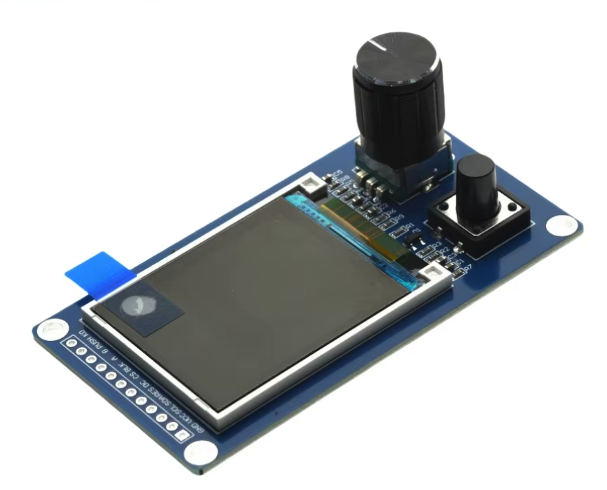

# Ultimate Timer

## Documentation

| Document | Description |
|---|---|
| [codingRules.md](codingRules.md) | Coding conventions and rules for this project |
| [menuStructure.md](menuStructure.md) | Menu layout, navigation, and event handling specification |
| [colorSettings.md](colorSettings.md) | Display color theme and UI color rules |
| [webUI.md](webUI.md) | Web UI architecture, behavior, menus, and API endpoints |

## Disclaimer
This software and/or  hardware is developed incrementally. That means I have 
no clear idea how it works (though it mostly does).

If you have questions about this software, it will probably take you just 
as long to figure things out as it would take me. So I’d prefer that you 
investigate it yourself.

Having said that ***Don’t Even Think About Using It***.

Seriously. Don’t.

Building this design may injure or kill you during construction, burn your 
house down while in use, and then—*just to be thorough*—explode afterward.

This is not a joke. This project involves lethal voltages and temperatures. 
If you are not a qualified electronics engineer, close this repository, 
step away from the soldering iron, and make yourself a cup of tea.

If you decide to ignore all of the above and build it anyway, you do so 
**entirely** at your own risk. You are fully responsible for taking proper 
safety precautions. I take zero responsibility for anything that 
happens—electrically, mechanically, chemically, spiritually, or otherwise.

Also, full disclosure: *I am not a qualified electrical engineer*. I provide 
no guarantees, no warranties, and absolutely no assurance that this design 
is correct, safe, or suitable for any purpose whatsoever.

## What it is
ESP32 cyclic timer for a 2.4 inch SPI TFT + EC11 rotary encoder module.

## Confirm to codingRules
Read `codingRules.md`

## Comply to Menu, and Event rules
read `menuStructure.md`

## Comply to Color Settings Display
read `colorSettings.md`

## Implemented structure
- Local TFT menu
- Rotary encoder editing
- Save Profile confirmation via [No] [Yes] buttons for the active profile
- New Profile name entry with character-by-character editing
- JSON profiles in LittleFS
- Trigger and reset inputs
- Output control with selectable polarity
- Web UI with matching timer settings
- Web UI live-apply for timer settings (apply immediately, save only on explicit save)
- System settings stored separately from profile timer fields
- Profile dropdown refresh keeps current selection
- `repeatCount = 0` support for infinite cycles
- TFT status updates while running with partial line redraw (no full-screen flicker)
- Build-time configuration through `build_flags` in `platformio.ini`
- Optional color test mode through `TEST_COLOR_PATERN`

## Local TFT controls
- Timer screen shows: `State`, `On time`, `Off time`, `Output`, and `Cycles`.
- `Output` line includes a live countdown timer (`MMM:SS`) to the next ON/OFF switch while running/paused.
- Open the local menu with a **long press on the rotary encoder**.
- Select menu options with a **short press on the rotary encoder**.
- Menu navigation is clamped (no wrap-around).
- Timer action row includes `Start`, `Stop`, `Reset`.
- Menu list items are rendered left-aligned with a two-character prefix area: selected item is shown as `> Item <`, unselected items use leading spaces so text starts at the same position.

### Main menu options
- `Timer Settings`
- `Save Profile`
- `Load Profile`
- `New Profile`
- `Delete Profile`
- `System Settings`
- `Exit` (return to status screen)

### Press duration build flags
The press durations are configurable in `platformio.ini` via `build_flags`:
- `ENCODER_SHORT_PRESS_MS`
- `ENCODER_MEDIUM_PRESS_MS`
- `ENCODER_LONG_PRESS_MS`
- `BUTTON_SHORT_PRESS_MS`
- `BUTTON_MEDIUM_PRESS_MS`
- `BUTTON_LONG_PRESS_MS`

Current configured values in this repository:
- `ENCODER_SHORT_PRESS_MS=50`
- `ENCODER_MEDIUM_PRESS_MS=1000`
- `ENCODER_LONG_PRESS_MS=2000`
- `BUTTON_SHORT_PRESS_MS=50`
- `BUTTON_MEDIUM_PRESS_MS=1000`
- `BUTTON_LONG_PRESS_MS=2000`

## Notes
- Profile files are stored as `/<profileName>.json`
- Profile files store only: `onTimeValue`, `offTimeValue`, `onTimeUnit`, `offTimeUnit`, and `repeatCount`
- System-level settings such as trigger mode/edge, output polarity, lock input during run, auto-save profile, theme color, and encoder direction are stored separately in Preferences/NVS
- Built-in profile `default` cannot be deleted and is hidden from the Delete Profile list
- If the active profile is deleted, firmware automatically loads `default`
- The fallback access point is open (no password)
- If no WiFi credentials are found (or STA connection fails), use the local `WiFi Setup` menu: scan nearby APs, select SSID with the rotary encoder, then enter the WiFi password via rotary text input and save/apply.
- The local UI currently includes timer and profile management
- Local TFT WiFi credential editing is available through the rotary menu

## TFT display behavior
- All TFT text is rendered with the built-in monospaced font.
- Header uses the same calibrated blue background as selected action buttons.
- Header right side shows `No WiFi` when disconnected, or `HH:MM` when WiFi and NTP time are available.
- Header time is refreshed across all screens with a lightweight header-only redraw (at least once per 10 seconds while NTP time is valid).
- Selected action button is blue; not-selected action buttons are light gray.
- Button text is rendered in the calibrated high-contrast mapping used by this panel.
- Status screen redraws only changed lines for smooth runtime updates.
- In button-mode field input, buttons are centered and drawn directly on the black background near the bottom (no tile behind the button group).

## TEST_COLOR_PATERN mode
- Add `-D TEST_COLOR_PATERN` to `build_flags` in `platformio.ini` to enable test mode.
- In this mode, firmware only initializes the display and shows a color palette test screen.
- Timer/menu/WiFi runtime logic is skipped in this mode.

## TFT wiring/configuration hints
- This project currently targets an ST7789-based 2.4 inch SPI display module.
- Required signals include power, `CS`, `DC`, `RST`, `BL`, plus SPI `SCK` and `MOSI`.
- Rotation is configurable via `TFT_ROTATION` in `platformio.ini`.
