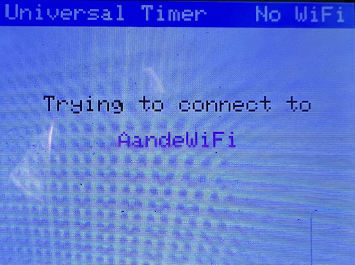
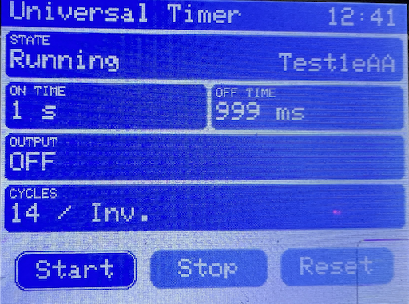
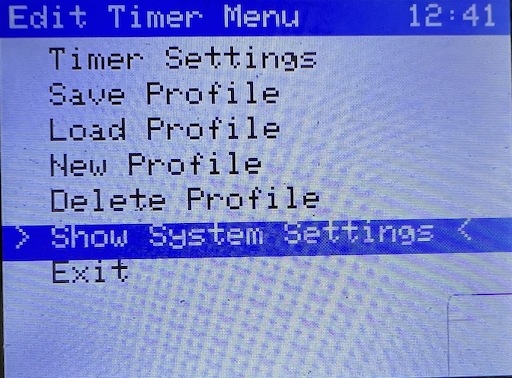
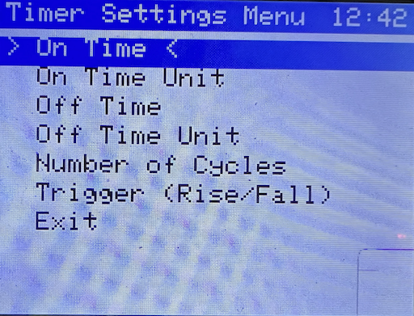

[← Back to README](README.md)

# Menu, Field Input and Eventhandling

## Selection rule:
- Selection of every menu item is always done with a SHORT press on the Rotary Encoder.
- Menu navigation is clamped: top item stays top, bottom item stays bottom (no wrap-around).

## Build flag test mode:
- If `TEST_COLOR_PATERN` is defined, normal menu flow is bypassed and only a color pattern test screen is shown.

## Menu hierarchy:
```
[Start]
  |
[Trying to connect to]
```
<div align="center">

</div>

```
[<SSID>] (centered)
  |
  V
[Timer Screen]
```
<div align="center">

</div>

```
- Start (SHORT press when selected)
- Stop (SHORT press when selected)
- Reset (SHORT press when selected)
- Action row is shown near the bottom of the screen.
  |
"Encoder Long Press"
  |
  V
[Edit Timer Menu]
```
<div align="center">

</div>

```
- Timer Settings -> [Timer Settings Menu]
- Save Profile -> [Save Profile Menu]
- Load Profile -> [Load Profile Menu]
- New Profile -> [New Profile Menu]
- Delete Profile -> [Delete Profile Menu]
- Show System Settings -> [Show System Settings Menu]
- Exit -> return to [Timer Screen]

[Timer Settings Menu]
```
<div align="center">

</div>

```
- On Time
- On Time Unit
- Off Time
- Off Time Unit
- Number of Cycles
- Trigger (Rise/Fall)
- Exit -> return to [Timer Screen]
- PIN_KEY0 MEDIUM or LONG press -> return to [Edit Timer Menu]

### Timer Settings persistence rule (source: `DEFAULT_AUTO_SAVE_LAST_PROFILE`)
- `DEFAULT_AUTO_SAVE_LAST_PROFILE=1`:
  - Every change in `Timer Settings Menu` is applied immediately to the active runtime timer state.
  - The same changed state is also written immediately to the active profile.
- `DEFAULT_AUTO_SAVE_LAST_PROFILE=0`:
  - Every change in `Timer Settings Menu` is applied immediately to the active runtime timer state.
  - The changed state is **not** written to the active profile automatically.
  - Profile write only happens on explicit profile save action.

[Save Profile Menu]
- Confirmation buttons: [No] [Yes]
- Label shows active profile name: Save "<activeProfile>"?
- Default selection is [No] (least destructive first)
- [Yes] saves current active profile and returns to [Edit Timer Menu]
- [No] cancels and returns to [Edit Timer Menu]

[Load Profile Menu]
- Profile list
- Loading a profile resets executed cycles to 0
- Exit (last item) -> return to [Edit Timer Menu]

[New Profile Menu]
- Profile field input (alphanumeric, fixed positions)
- Auto return to [Edit Timer Menu] after last position is confirmed

[Delete Profile Menu]
- Profile list
- Default profile is never shown in this list
- Selecting a profile opens confirmation buttons: [No] [Yes]
- Default selection is [No] (least destructive first)
- Deleting the active profile immediately loads [default]
- Exit (last item) -> return to [Edit Timer Menu]

[Show System Settings Menu]
- WiFi SSID (RO display only, cursor skips this item, only shown if WiFi enabled)
- IP Address (RO display only, cursor skips this item, only shown if WiFi enabled)
- MAC Address (RO display only, cursor skips this item)
- WiFi Disabled: Yes (RO display only, cursor skips this item, only shown if WiFi disabled)
- Encoder Order (A-B / B-A) — SHORT press toggles directly in the list
- Erase WiFi credentials — opens button screen [No] [Yes]
- Start WiFi Manager — opens button screen [No] [Yes]; Yes clears WiFi Disabled flag and restarts
- Output Polarity — opens button screen [High] [Low]
- Theme Color — opens button screen (2 rows): [Red][Green][Blue] / [Indigo][Violet][Yellow]
- Restart ultimateTimer — opens button screen [No] [Yes]
- Exit -> return to [Edit Timer Menu]

[WiFi Manager Started]
- Connect to AP (centered, wrapped if needed)
- AP name (centered, wrapped if needed)
- [Cancel WiFi Manager]
- Cancel WiFi Manager -> sets WiFi Disabled/Ignore flag and returns to [Timer Screen] without restart
```

# platforio.ini
> **Source of truth: `platformio.ini` is always leading.**
> If any `build_flags` value in `platformio.ini` differs from the value mentioned anywhere in the documentation (any `.md` file), the value in `platformio.ini` is correct.
> `platformio.ini` must **never** be changed to match documentation.
> The documentation must be updated to match `platformio.ini`.

# ======= Event Handling =======
These `build_flags` triggers events.

```
 ENCODER_SHORT_PRESS_MS=50
 ENCODER_MEDIUM_PRESS_MS=1000
 ENCODER_LONG_PRESS_MS=2000
 BUTTON_SHORT_PRESS_MS=50
 BUTTON_MEDIUM_PRESS_MS=1000
 BUTTON_LONG_PRESS_MS=2000
```
## Event Handling should be as follows:
Every press shorter than `XX_SHORT_PRESS_MS` is considered switch-bouncing or noice!

Presses between `XX_SHORT_PRESS_MS` and `XX_MEDIUM_PRESS_MS` triggers the `XX_SHORT_EVENT`

Presses between `XX_MEDIUM_PRESS_MS` and `XX_LONG_PRESS_MS` triggers the `XX_MEDIUM_EVENT`

Presses equal or longer than `XX_LONG_PRESS_MS` triggers the `XX_LONG_EVENT` and triggers imediatly after the time has passed. It does not wait for the button release!

A `BUTTON_MEDIUM_EVENT` has in all menu's the same effect as selecting `Exit` in the menu's.

**PIN_KEY0 behavior in ALL menus:**
- `PIN_KEY0 SHORT press`: In field input, moves cursor 1 position left. At the first position, exits without saving. In regular menus, no effect.
- `PIN_KEY0 MEDIUM press`: In regular menus, acts as Exit/Back to the parent menu immediately. In field input, saves and returns.
- `PIN_KEY0 LONG press`: Same behavior as MEDIUM press, but triggers immediately when LONG_PRESS_MS is reached (does NOT wait for button release).
# ======= Field Input =======

## Field Input behavior:
- Start at the left-most position.
- Rotating the encoder changes the token at the current cursor position.
- SHORT press moves the cursor to the next position. At the last position, SHORT press does nothing (cursor stays).
- For alphanumeric profile-name input: if the current token is "-", SHORT press must NOT move the cursor right.
- ENCODER MEDIUM or LONG press at any position saves the field value and returns to the previous menu.
- PIN_KEY0 SHORT press moves the cursor 1 position to the left. At the first (left-most) position, exits without saving.
- PIN_KEY0 MEDIUM or LONG press saves the field value and returns to the previous menu.
- For `Timer Settings Menu` field input targets, save-to-profile behavior follows `DEFAULT_AUTO_SAVE_LAST_PROFILE` exactly as defined above.

## Generic field input parameters:
- fieldName
- positionCount
- tokenList

### Token lists:
- Numeric: 1,2,3,4,5,6,7,8,9,0
- Alphanumeric: A,a,B,b,C,c,...,Y,y,Z,z,-,1,2,3,4,5,6,7,8,9,0
- Special: ms, s, Min

## Button-mode field input:
When `positionCount == 1` and `tokenCount` is 2–6, the field input renders as a button grid instead of a token scroll.
- 2–4 options: single row of buttons.
- 5–6 options: two rows of 3 buttons each.
- Buttons are drawn on the black screen background (no surrounding tile panel).
- Buttons are centered horizontally; in two-row mode the lower row sits near the bottom and the upper row is placed directly above it.
- All buttons rendered **identically** to the Timer Screen Start/Stop/Reset buttons: dark fill + inner border = selected, light fill = inactive.
- `getUiSelectedFillColor()` / `getUiSelectedBorderColor()` / `getUiSelectedTextColor()` for selected.
- `getUiInactiveFillColor()` / `getUiInactiveBorderColor()` / `getUiInactiveTextColor()` for unselected.
- Selected button gets an extra inner border with `ST77XX_BLACK` (appears WHITE on the inverted panel).
- Corner radius = 8 (matches Timer Screen).
- Encoder LEFT/RIGHT cycles the selection.
- Encoder SHORT press saves the currently selected button value immediately and returns to the previous menu.
- Encoder MEDIUM or LONG press also saves and returns.
- PIN_KEY0 SHORT press at cursor position 0 exits without saving.
- PIN_KEY0 MEDIUM or LONG press saves and returns.

### Button token sets used in System Settings:
- Confirm actions: `[No] [Yes]` (confirmNoYesTokens)
- Output polarity: `[High] [Low]` (outputPolarityTokens)
- Theme color: `[Red][Green][Blue]` / `[Indigo][Violet][Yellow]` (themeColorTokens, 6 items → 2 rows)

## Status output countdown:
- Format is MMM:SS while running/paused.
- Idle placeholder is ---:--.

[← Back to README](README.md)
